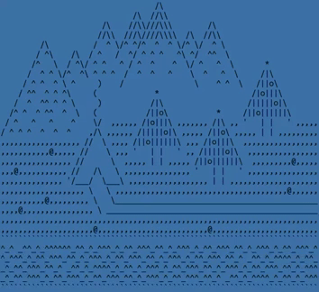

<ul style="line-height: 2; list-style-type: none; padding-left: 10px;">
  
&nbsp;&nbsp;&nbsp;😉&nbsp;Pavel Klyukin.

  
&nbsp;&nbsp;&nbsp;📍&nbsp;Russia, Moscow.

  
&nbsp;&nbsp;&nbsp;💻&nbsp;Python dev.

</ul>
 
