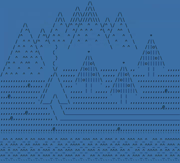

<ul style="line-height: 2; list-style-type: none; padding-left: 10px;">
  
&nbsp;&nbsp;&nbsp;😉&nbsp;Pavel Klyukin, 19 y.o.

  
&nbsp;&nbsp;&nbsp;📍&nbsp;Russia, Moscow.

  
&nbsp;&nbsp;&nbsp;💻&nbsp;Python backend developer.

  
&nbsp;&nbsp;
    
    Student at <a href="https://mai.ru">MAI</a>, Computer Science (<a href="https://institutes.mai.ru/computing/">01.03.02</a>).
  

</ul>
 